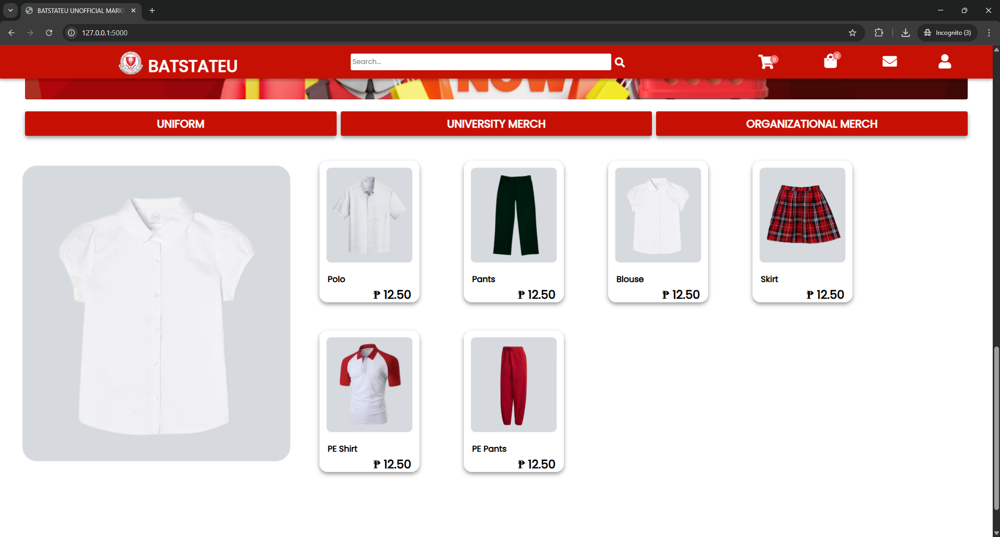
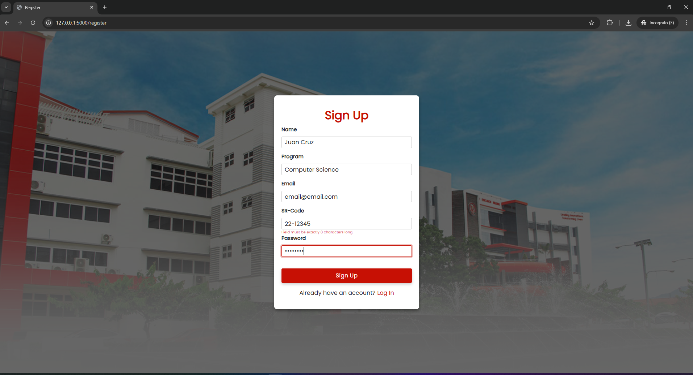
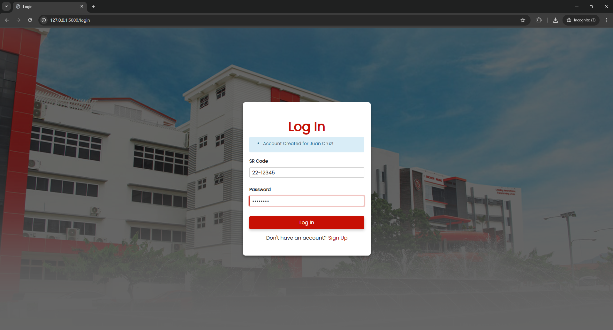
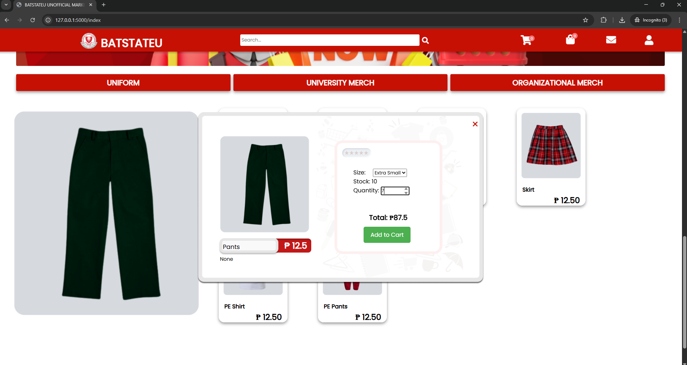
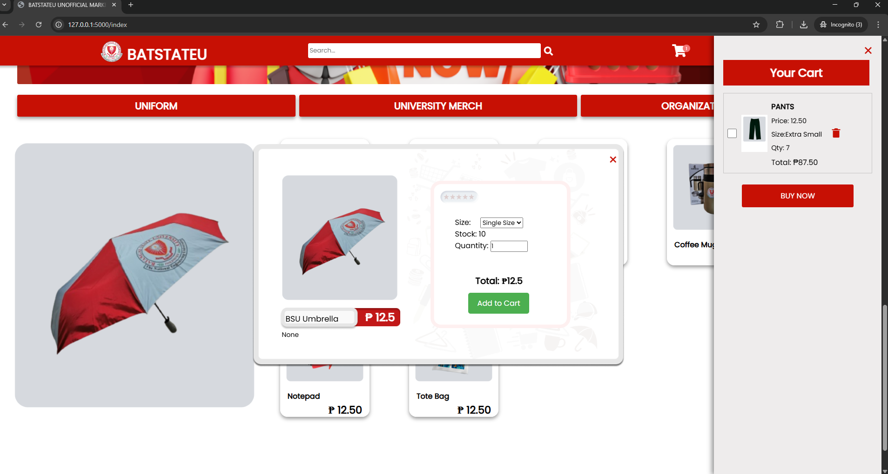
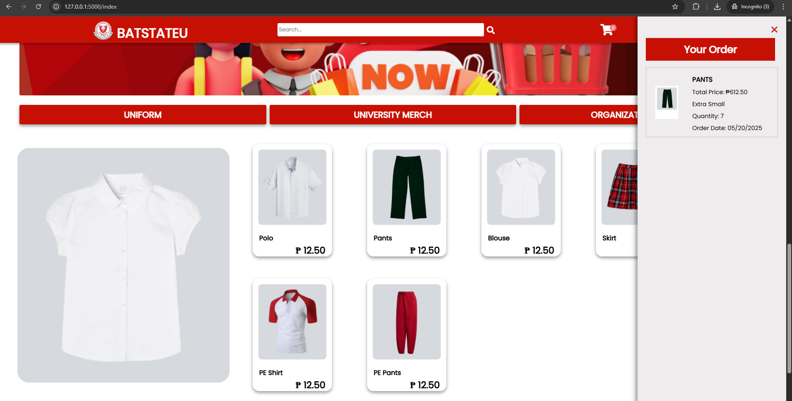

# BatState-U Community Marketplace

<br> A proposed community marketplace for Batangas State University. A centralized shop for students' educational necessities. 
<br>

## Installation and Set-up
  &nbsp;&nbsp;&nbsp; First install the dependencies required on the requirements.txt. To do this run  the `terminal` and enter the command below.

``` powershell
    pip install -r requirements.txt
```
&nbsp;&nbsp;&nbsp; To run the program, open the `termminal` and navigate on the project directory using `cd` then run the command below.
```powershell
  python run.py
```


<br><br>

## <a id = "proj-obv"> 🎯Project Overview </a> <br>
 The BatState-U Community Marketplace is a web application designed to serve as a centralized platform, while also allowing students to offer their service and product to the BatState-U community.  This marketplace aims to streamline the process of acquiring academic essentials and other services – providing a convenient and efficient solution for the BatState-U community.

 <br>


## <a id = "demo">🚩Demo and Screenshots

#### Home page


> The default page is the index route which is the home page. To place an order or add items to cart the user must be logged in first. 

<p align = "center">
   
</p>

#### Register page 

<p align = "center">
   
</p>


#### Login page


<p align = "center">
   
</p>


#### Adding Items to Cart
>Adding Items to cart from the Uniform section

<p align = "center">
   
</p>


#### Adding Items to Cart
>Adding Items to cart from the University Merch section

<p align = "center">
   
</p>


#### Order


<p align = "center">
   
</p>


#### Invoice


<p align = "center">
   
</p>

   
<br>

##  <a id = "tech-stacks"> ⚙️ Technology Stack </a><br>
The following listed tools are utilized in this project. <br>

<b>Backend</b> 
- [x] Flask <br> 

<b>Database </b>
- [x] SQLite


<b>Front-End </b>

- [x] HTML/CSS <br> 
- [x] Bootstrap <br> 
- [x] Javascript <br>

<br>


In addition, the dependencies and libraries that are found in the `requirements.txt` are listed below:
- [x]   alembic==1.12.1
- [x]   bcrypt==4.0.1
- [x]   blinker==1.7.0
- [x]   click==8.1.7
- [x]   colorama==0.4.6
- [x]   dnspython==2.4.2
- [x]   email-validator==2.1.0.post1
- [x]   Flask==3.0.0
- [x]   Flask-Bcrypt==1.0.1
- [x]   Flask-Login==0.6.3
- [x]   Flask-Migrate==4.0.5
- [x]   Flask-MySQLdb==2.0.0
- [x]   Flask-SQLAlchemy==3.1.1
- [x]   Flask-WTF==1.2.1
- [x]   greenlet==3.0.1
- [x]   idna==3.4
- [x]   importlib-metadata==6.8.0
- [x]   itsdangerous==2.1.2
- [x]   Jinja2==3.1.2
- [x]   Mako==1.3.0
- [x]   MarkupSafe==2.1.3
- [x]   mysqlclient==2.2.0
- [x]   SQLAlchemy==2.0.23
- [x]   typing_extensions==4.8.0
- [x]   Werkzeug==3.0.1
- [x]   WTForms==3.1.1
- [x]   zipp==3.17.0
<br>

##  <a id = "roadm"> 🛣️ Future</a> <br>


##### 1. Payment System Integration
<br>

- To enhance the user experience, the future development of the BatState-U Community Marketplace will include the integration of a secure and user-friendly payment system. This will allow users to seamlessly conduct transactions within the platform, providing a convenient way to purchase educational necessities and other services.
<br>

##### 2. Migration to a Production Database
<br>

- As the platform evolves, there will be a transition from the current development database to a robust production database. This migration aims to optimize data storage, retrieval, and overall system performance, ensuring a smooth and reliable experience for users.
<br>

<br>

##### 3. Enhanced Security Features
<br>

- To prioritize the safety and privacy of users, the future releases of the marketplace will implement advanced security measures. This includes encryption protocols, secure authentication processes, and regular security audits to identify and address potential vulnerabilities.
<br>


##### 4. App Policy Implementation
<br>

- A comprehensive set of policies governing products, ordering processes, and payments will be established. These policies will ensure a fair, transparent, and secure environment for both buyers and sellers. Users will be provided with clear guidelines, contributing to a positive and trustworthy community marketplace.


<br>


##### 5. Improved Scalability Across Different End-Devices


<br>


- To cater to the diverse needs of the BatState-U community, the marketplace will undergo optimizations for improved scalability. This includes responsive design elements and performance enhancements to ensure a seamless experience across various devices such as desktops, tablets, and smartphones.

<br>

##### 6. Buyer and Seller Interaction Features

<br>


- The future iterations of the BatState-U Community Marketplace will introduce features that facilitate communication between buyers and sellers. This may include chat functionality, order status updates, and a rating system to build a sense of community and trust among users.

<br>


##### 7. Enhanced UI Design

<br>


- Aesthetics and usability play a crucial role in user satisfaction. The marketplace will undergo a UI (User Interface) overhaul to provide an intuitive, visually appealing, and user-friendly interface. This enhancement aims to make navigation and interaction more engaging and enjoyable for the BatState-U community.
<br>

<br>


##  <a id = "contrib"> 👷‍ Contributors </a> <br>

| Name | Role | E-mail | Other Contacts |
| --- | --- | --- | --- |
| <a href = "https://github.com/DirkSteven">Dirk Steven E. Javier</a> | Project Leader | dirkjaviermvp@gmail.com | Allonsy -Discord |
| <a href = "https://github.com/LanceAndrei04">Lance Andrei Espina </a>|  Developer  | lanceandrei.espina30@gmail.com |  |
| <a href = "https://github.com/AeronEvangelista">Aeron Evangelista </a>| Developer | mr.aeronevangelista@gmail.com | Zayed - Discord|


<br>


##  <a id = "notes"> 📝 Notes </a><br>
<!-- [1] *** INSERT NOTE ***

[2] *** INSERT NOTE *** -->

<br><br>


